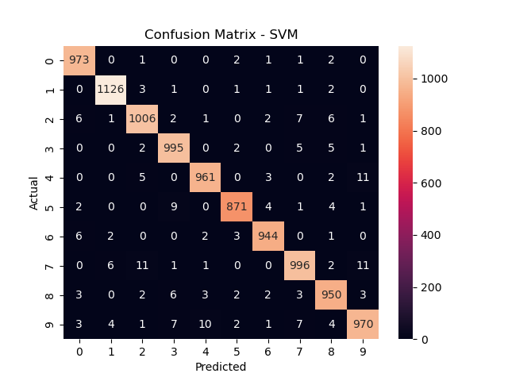
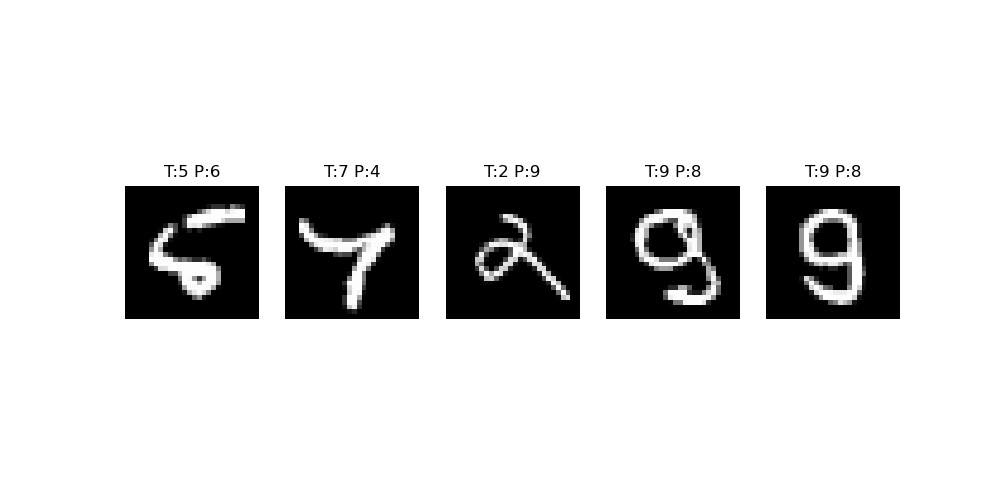

# Handwritten Digits Recognition (MNIST)

This project focuses on classifying handwritten digits (0–9) using Machine Learning and Deep Learning models.

---

## Dataset
- MNIST dataset (28x28 grayscale images)
- 60,000 training + 10,000 testing samples

---

## Models Implemented
- Logistic Regression
- K-Nearest Neighbors (KNN)   
- Support Vector Machine (SVM)  
- Artificial Neural Network (ANN)  

--

## Results

| Model | Accuracy |
|------|--------|
| Logistic Regression | 0.9259 |
| K-Nearest Neighbors (KNN) | 0.9705 |
| Support Vector Machine (SVM) | 0.9792 |
| Artificial Neural Network (ANN) |  0.9736 |

 **Best Model: SVM**

---

## Evaluation

### Confusion Matrix

### Misclassified Samples

---

## Key Learnings
- Importance of proper evaluation beyond accuracy  
- Handling high-dimensional image data  
- Comparing ML vs Deep Learning models  

---

## Future Improvements
- Implement CNN for better performance  
- Hyperparameter tuning  
- Real-time digit recognition app  

---

## Tech Stack
- Python  
- Scikit-learn  
- TensorFlow / Keras  
- Matplotlib / Seaborn  
